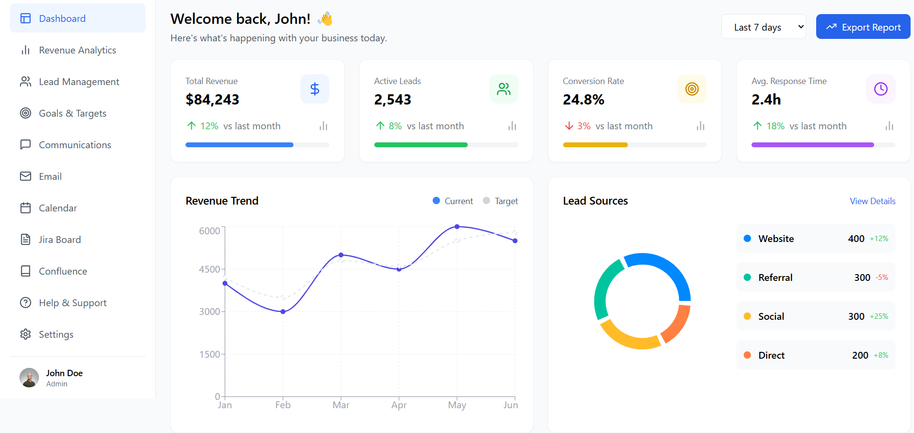
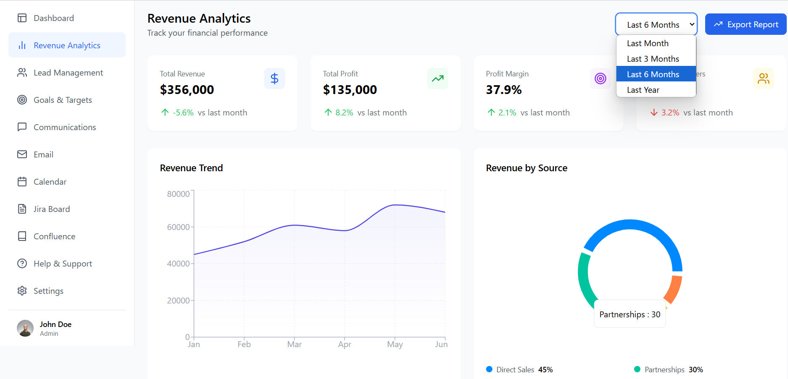
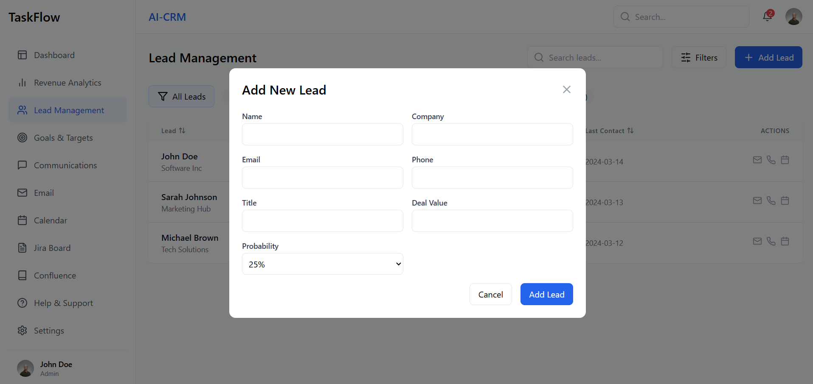

# IntelliHack SRM 2025 – CRM Project

## Team Name: Mors Manipulus

### Team Members:
- **Team Leader:** Ranveer Singh  
- **Member 1:** Aryan Somanna  
- **Member 2:** Shrey Jauhari  
- **Member 3:** Lopa Khushi  

---

## 📌 Project Title:
**AI-Powered CRM with Integrated Voice Assistant**

---

## 🧠 Project Description:

Our project is an intelligent, AI-driven Customer Relationship Management (CRM) platform designed to streamline client interactions, automate scheduling, and improve customer engagement through voice-enabled reminders and communication.

This CRM system includes:
- 🔹 **AI Assistant:** Automates scheduling by intelligently setting up meetings based on context and availability. It analyzes client inputs and organizes the calendar accordingly.
- 🔹 **Voice Calling Module:** Enables in-app calling to clients or team members without needing external applications.
- 🔹 **Voice Reminder System:** The voice assistant actively reminds users of upcoming tasks, follow-ups, and meetings—boosting productivity and reducing missed engagements.

---

## 🚀 Key Features:

- ✅ Smart Lead and Contact Management  
- ✅ AI-based Scheduling Assistant  
- ✅ Voice Calling Integration  
- ✅ Real-Time Voice Reminders  
- ✅ Responsive UI/UX for all device types  
- ✅ Dashboard with Analytics and Notifications  

---

## 💡 Tech Stack:

- **Frontend:** HTML5, CSS3, JavaScript  
- **Backend:** Node.js  
- **AI/ML Integration:** OpenAI API  
- **Voice Services:** Web Speech API, Twilio (for voice calling)  
- **Database:** Superbase
- **Deployment:** Netlify  

---

## 🧪 How to Run Locally:

1. **Clone the repository**

2. **Install dependencies**

3. **Run backend server**

## 🌐 Project Link

**Live Demo:** [https://snazzy-taiyaki-2a761b.netlify.app/calendar]

THIS IS THE DASHBOARD -->>

.
This is portal to add new entries 
.

